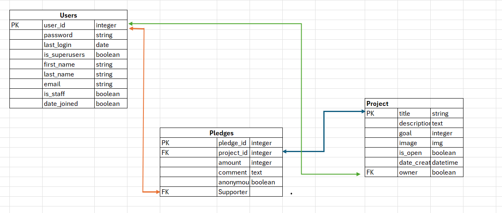
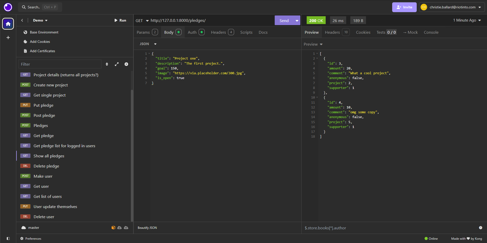
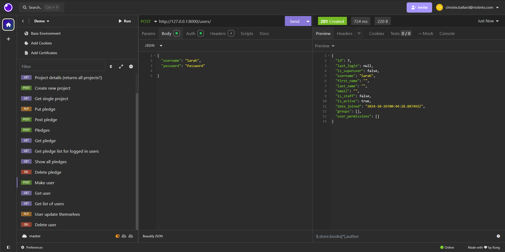
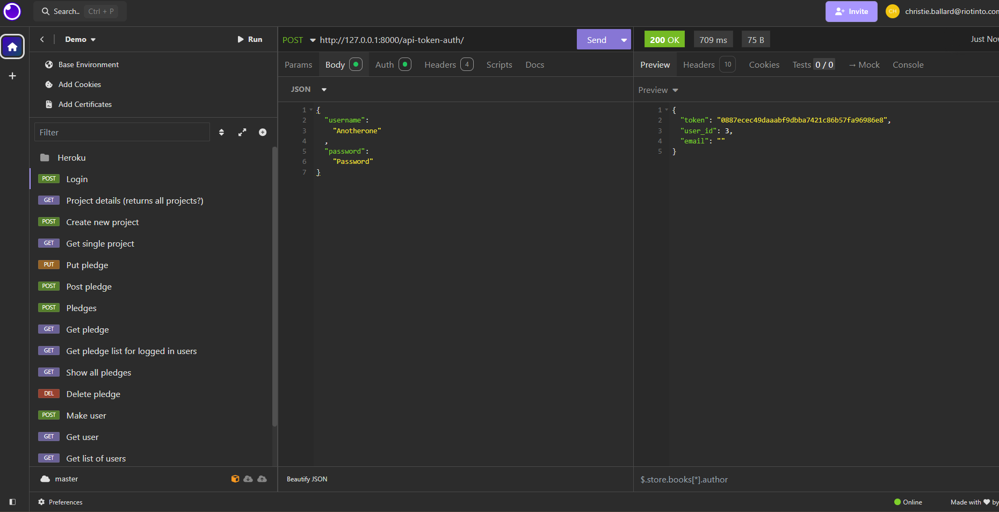

# Crowdfunding Back End
{{ Christie Ballard }}

## Planning:
### Concept/Name
{{ Gemtime. Gem time puts an arbitrary value on employees time. Employees can earn and burn gems by giving their time to team members or swapping their acquired gems for time with senior leadership }}

### Intended Audience/User Stories
{{ Large matrix organisations. It will be a landing page that eventually links to calendar entires 
Buyer/organisation story: I want to encourage a flatter structure in my organisation, by encouraging a culture of support across all talent levels
User stories:
mid-tier: I have skills and knowledge to share, and I want time with my seniors. Let me give my time to junior staff so I can earn time with leaders
}}

### Front End Pages/Functionality
- {{ GemTime website }}
    - {{ Has login page }}
    - {{ Has profile page with Gem balance }}
    - {{ Has "Earn page" where users can make pledges with their time }}
    - {{ Has "Burn page" where users can spend their gems by bidding on pledges }}
    - {{ Future iteration: shows calendar availability and how many gems are needed to book time}}

### API Spec
{{ Fill out the table below to define your endpoints. An example of what this might look like is shown at the bottom of the page. 

It might look messy here in the PDF, but once it's rendered it looks very neat! 

It can be helpful to keep the markdown preview open in VS Code so that you can see what you're typing more easily. }}

| URL | HTTP Method | Purpose | Request Body | Success Response Code | Authentication/Authorisation |
| --- | ----------- | ------- | ------------ | --------------------- | ---------------------------- |
|  api-token-auth   |   POST |    Login   |    User name and password  |     200     |      anyone            |
| projects/ | GET | Returns all projects | n/a | 200 | n/a 
| projects/ | POST | Create new project | Project object | 201 | Must be logged in
| projects/ | GET | Returns the project with the ID of "1" | n/a | 200 | n/a
| pledges/1 | PUT | Returns the project with the ID of "1" | Project object | 200 | Must be logged in. Must be project owner.
| pledges/ | POST | Creates a new pledge | Pledge object | 201 | Must be logged in. Must be project owner.
| pledges/2 | GET | Get the pledge with ID of "2" | n/a | 200 | Must be logged in. Must be project owner.
| pledges/1 | DELETE | Deletes the pledges of ID of "1" | n/a | 200 | Must be logged in. Must be pledge owner. 
| pledges/ | GET | list of all pledges for logged in users | n/a | 200 | Must be logged in. Must be pledge owner.
| users/ | POST | Create user | {"username": "Type user name here","password": "Type password here"} |201 | Must be logged in.
| users/1 | GET | Find single user | n/a | 200 | Must be logged in.
| users | GET | List of all users | n/a | 200 | Must be logged in.
| users/1 | PUT | So users can update themselves | n/a | 200 | Must be logged in.
| user/1 | Delete | Delete user | n/a | 200 | Must be logged in

### DB Schema

Successful GET

Successful POST

Successful Token returned

How to register a new user and create a new project:
New User:
- URL Post request 
- Complete JSON e.g.
{
	"username": "Sarah",
	"password": "Password"

}
- Hit SEND 
- Get 201 Created message
- joy

New Project:
- URL Post request
- Complete JSON e.g.
{
	"title": "Remix; Another example project",
	"description": "Brat.",
	"goal": 100,
	"image": "https://via.placeholder.com/300.jpg",
	"is_open": true,
	"date_created": "2020-03-20T14:28:23.382748Z"
}
- Hit SEND 
- Get 201 Created message
- joy